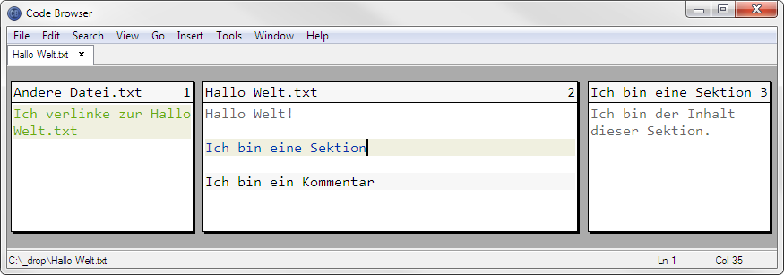
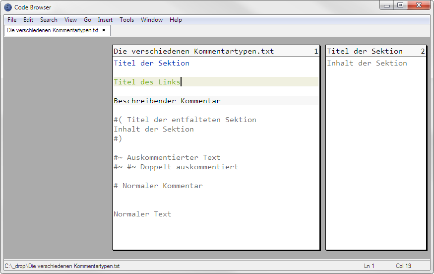

# Code Browser 4.9

*[Read in english](README_EN.md)*

[Einführung](#einführung) • [Warum dieses Repo](#warum-dieses-repo) • [Installation](#installation) • [Tastenkürzel](#tastenkürzel) • [Tips und Tricks](#tips-und-tricks) • [Direktiven](#direktiven) • [Credits](#credits)

*Bildschirmfoto von Code Browser.*

## Einführung

[Code Browser](http://tibleiz.net/code-browser/) ist ein Zen-artiger Text-Editor, geschrieben von [Marc Kerbiquet](http://tibleiz.net/). Er lädt schnell und zeigt auch große Dateien ohne Murren an. Er verfügt über eine eigene Skriptsprache, mit Hilfe derer man die Funktionalität des Editors erweitern kann.

Seine revolutionäre Eigenschaft aber besteht darin, wie er spezielle formatierte [Direktiven](#direktiven) im Quellcode interpretiert und anzeigt:

* *Sektionen* (englisch: *Sections*). Blau im Bildschirmfoto. Sie falten frei zu wählende Teile des Codes weg. Man kann in solche Sektionen mittels `Alt` + (`→` oder `←`) hinein und hinaus navigieren, so wie man in Datei-Browsern in Ordner hinein und hinaus navigieren kann. Weshalb Sektionen ursprünglich von Marc Kerbiquet auch *Folder* (deutsch: *Ordner*) genannt wurden.

  Sektionen können beliebig tief verschachtelt werden. Somit kann man eine lineare Code-Datei in einen Baum aus 'Mini-Dateien' umwandeln, was der Code-Strukturierung sehr förderlich ist. Es bleibt allerdings tatsächlich eine einzelne Datei.
* *Links*. Grün im Bildschirmfoto. Sie erweitern das Konzept, und ermöglichen es, Verweise zu anderen Sektionen oder auch zu anderen Dateien einzufügen, vergleichbar zu [Hyperlinks](https://de.wikipedia.org/wiki/Hyperlink) in HTML-Dokumenten. In der Praxis werden Links gerne in indexierenden Dateien oder Doku´s eingesetzt, seltener im Code selbst. Sie bieten weitere interessante Möglichkeiten wegen ihrer Fähigkeit, auf Zeilennummern oder sogar auf Suchresultate regulärer Ausdrücke zu verlinken.
* *Beschreibungen* (englisch: *Descriptions*). Der Text mit grauem Hintergrund im Bildschirmfoto. Sie sind 'visueller Zucker'. Es handelt sich um hübsch anzusehende, wahlweise farbig hervorgehobene Kommentare. Die Kommentarzeichen werden ausgeblendet.

Mehr Informationen dazu gibt´s in der Hilfedatei oder [auf der Projektseite](http://www.tibleiz.net/code-browser/code-folding.html).

## Warum dieses Repo?

Nach Version 4.9 hat der Autor leider ein wichtiges Feature entfernt – relative Einrückung (siehe *Folding* → *Relative Indentation* in der Hilfedatei) – was den Editor für einrückungsbasierte Sprachen wie [Python](https://www.python.org/) oder [Nim](https://nim-lang.org/) eher unbrauchbar gemacht hat. Ferner wurde die Geschwister-Navigation verändert – `Strg` + `Umschalttaste` + (`↑` oder `↓`) – welche nun die Ebene wechselt wenn man über Sektionsgrenzen hinweg navigiert.

Da ich diese Features in [Treesearcher](https://github.com/heronils/Treesearcher) benötige, hier ein Backup von Version 4.9, dazu ferner meine globalen Einstellungen und meine Benutzerskripte.

## Installation

1. Lade die zu deinem Betriebssystem passende Portable aus dem hier befindlichen Ordner `Setup` herunter und [entpacke](https://www.7-zip.de/) Sie. Der Editor ist die `cb.exe` unter Windows und die `code-browser` im Ordner `usr/local/bin` unter Linux.

Die nachfolgenden Schritte sind optional.

2. Lies den Abschnitt *Customizing* → *Files* in der beigefügten Hilfedatei.

3. Starte den Editor einmal. Das erstellt die unter 2. beschriebenen Nutzerverzeichnisse.

4. *Globale Einstellungen ändern*: Ersetze die globale `preferences.cbc` mit der in diesem Verzeichnis.

   Die Hauptunterschiede sind: Relative Einrückung wird als Standard gesetzt, ein (meiner Meinung nach) hübscher anzusehendes Theme wird verwendet (Siehe *Themes* → *Bob* in der `preferences.cbc`), einige Tastenkürzel werden umdefiniert (siehe *Key Mappings* → *Bob*), und einige Sprachen werden geändert (siehe *Languages*). Auch wird unter Anderem Python als Tool definiert (`Alt` + `p`, siehe *Tools*).

   Die `preferences.cbc` kann nach Belieben verändert werden, **wird aber bei einer Neuinstallation – [falls Du den Installer verwendet hast](https://web.archive.org/web/20160912162221/http://tibleiz.net:80/code-browser/download.html) – überschrieben**.

5. *Benutzerskripte aktivieren*: Verschiebe die `user.cbs` und die `user.cbc` hier im Verzeichnis in das in Schritt 3 erstellte Benutzerverzeichnis. Die `user.cbs` sind die Skripte, und die `user.cbc` verbindet die Skripte mit dem Editor.

   *Beachte, daß das Layout der `user.cbc` zerstört wird, wenn Du Änderungen innerhalb von Code Browser via 'Tools' → 'Options...' vornimmst. Mach Dir zur Not ein Backup dieser Datei.*

   Die Benutzerskripte bieten weitere Funktionen, wie das Falten und Entfalten von Sektionen und das Auskommentieren von Code-Abschnitten. Es ist derzeit kein hübscher Code – ich habe die Skripte vor langer Zeit geschrieben – aber sie funktionieren. Eine Überarbeitung ist in Planung.

## Tastenkürzel

[Wenn meine Benutzerskripte und meine Nutzereinstellungen installiert sind](#installation), verwendet der Code Browser die folgenden Tastenkürzel. Die Kürzel können unter `preferences.cbc` → *Key Mappings* → *(aktiviertes Key Mapping)* geändert werden. Die mit dem Text `(Benutzerskript)` dahinter werden von meinen Benutzerskripten definiert und können in der `user.cbc` geändert werden.

### Grundlegendes

* `Strg` + `z` und `Strg` + `y` – Undo und Redo
* `Strg` + `Umschalttaste` + `s` – Speichere alle Dateien, auch die nicht sichtbaren (Zum Beispiel solche, die man verändert hat und aus denen man dann via Link hinaus navigiert ist).
* `Esc` – Schließe jeglichen Dialog unterhalb des Editors oder, wenn kein Dialog offen ist, schließe den aktuellen Tab.
* `Alt` + `f4` – Beende Code Browser. Wenn Dateien ungespeichert sind, wird Code Browser nachfragen was getan werden soll.
* ... und noch weitere, die man im Hauptmenü einsehen kann.

### Ansichtsmodi

* `F4` bis `F7` – Zwischen den vier verschiedenen Ansichtsmodi von Code Browser wechseln.

  *Wegen eines Bugs in Code Browser kann man nicht mehr zu einem vorherigen Dokument via Link zurücknavigieren, wenn man zwischendrin den Ansichtsmodus wechselt. In dem Fall muss man das vorherige Dokument von Hand wieder öffnen.*

### Navigation

* `Alt` + (`↑` oder `↓`) – Zur vorherigen oder zur nächsten Sektion/Link springen.
* `Alt` + (`→` oder `←`) – In eine Sektion/einen Link hinein- oder aus ihr wieder hinaus navigieren.
* `Strg` + `Umschalttaste` + (`↑` oder `↓`) – Zur vorherigen oder nächsten Geschwister-Sektion/Link in der Eltern-Ebene springen – Abkürzung für `Alt` + `←`, `Alt` + (`↑` oder `↓`), `Alt` + `→`.
* `Strg` + `Alt` + (`↑` oder `↓`) *(Benutzerskript)* – Zum vorherigen oder zum nächsten Absatz springen (Absatz = Durch Leerzeilen getrennte Codezeilen). Zusätzlich `Umschalttaste` wählt den Absatz auch aus.
* `Alt` + `g` – Springe zur einzugebenden Zeilennummer.
* `Strg` + `b` – Springe zur entsprechenden Klammer. Zusätzlich `Umschalttaste` wählt den Text dazwischen aus.

### Sektionen

* `F12` – Eine neue Sektion erstellen. Wenn Text selektiert ist, wird dieser der Inhalt der Sektion werden.
* `Umschalttaste` + `F12` – Die Sektion unter dem Cursor löschen. Ihr Inhalt wird nicht gelöscht, sondern auf die Eltern-Ebene verschoben.
* `Alt` + `Enter` – Eigenschaften der Sektion oder des Links unter dem Cursor bearbeiten.
* `Strg` + `Alt` + (`←` oder `→`) *(Benutzerskript)* – Wenn etwas selektiert ist, die Selektion ein Zeichen nach links oder rechts verschieben, ansonsten den Absatz unter dem Cursor falten oder die Sektion unter dem Cursor entfalten.

  *Ohne den schließenden Marker einer entfalteten Sektion – z.B. `#)` in Python oder `/*)*/` in CSS – kannst du die Sektion nicht wieder zusammenfalten.*

### Links

* `Strg` + `Alt` + `c` – Kopiere einen Link zur aktuellen Sektion in die Zwischenablage. Kann dann mit `Strg` + `v` woanders – auch in andere Dateien – eingefügt werden. Damit das funktioniert, muss die Sektion und alle Eltern-Sektionen über eine ID verfügen (ID = Ein frei zu wählender Text). Diese kann für eine Sektion (oder einen Link) entweder von Hand hinzugefügt werden, mittels `Alt` + `Enter` wenn der Cursor sich auf der Sektions- oder Linkzeile befindet, oder einfach die Sektion einmal mit `Strg` + `Alt` + `→` entfalten und dann mit `Strg` + `Alt` + `←` wieder falten. Das setzt die ID mit dem Titel der Sektion gleich.

Es ist kein Tastenkürzel definiert, um einen Link von Hand zu erstellen, da das meines Erachtens sowieso ein umständliches Procedere ist.

### Beschreibungen

* `F11` oder `F10` – Den selektierten Text zu einer Beschreibung oder zurück zu normalem Text konvertieren.

### Text verschieben

* `Strg` + (`↑` oder `↓`) *(Benutzerskript)* – Die aktuelle Zeile oder Selektion eine Zeile nach oben oder nach unten verschieben. Die Selektion muss kein sauberer selektierter Block sein, es werden einfach alle Zeilen verschoben, in denen etwas selektiert ist. `Strg` + `Alt` + (`←` oder `→`) verschiebt die Selektion nach links oder rechts.

### Zeilen auskommentieren und entkommentieren

* (`Umschalttaste` +) `Alt` + `x` *(Benutzerskript)* – Die aktuelle Zeile oder die Selektion auskommentieren oder wieder entkommentieren. Verwendet `<Kommentarzeichen der Sprache>~<Leerzeichen>` als Direktive, zum Beispiel `#~ ` in Python. Funktioniert rekursiv bei Sektionen.

  *Mehreres Auskommentieren hintereinander funktioniert derzeit nicht korrekt mit Sprachen wie CSS, die keine einzeiligen Kommentare haben.*

### Lesezeichen

* `Strg` + `F2` – Ein Lesezeichen setzen.
* (`Umschalttaste` +) `F2` – Zum nächsten oder vorherigen Lesezeichen springen. Lesezeichen-Navigation funktioniert nur innerhalb einer einzelnen Datei und Lesezeichen sind nicht dauerhaft zwischen Sitzungen.
* (`Umschalttaste` +)`Strg` + `m` – Hebe alle Vorkommen des aktuell selektierten Textes im aktuellen Dokument hervor oder entferne alle Hervorhebungen.

### Suchen und ersetzen

* `Strg` + `r` – Öffne den *Suchen und ersetzen*-Dialog.
* `Alt` + `r` – Wenn der *Suchen und ersetzen*-Dialog den Fokus hat, wähle das erste Suchresultat aus, oder ersetze es und wähle das nächste Suchresultat aus. Leider kann dieses Tastenkürzel nicht geändert werden.
* (`Umschalttaste` +) `F3` – Finde das nächste oder das vorherige Suchresultat, ersetze das aktuelle nicht.

## Tips und Tricks

* Das von meiner `preferences.cbc` verwendete Theme versucht, die folgenden Schriften in dieser Reihenfolge zu verwenden: *[Consolas](https://www.google.com/search?q=Download+Consolas+font)*, *[Lucida Sans Typewriter](https://www.google.com/search?q=Download+Lucida+Sans+Typewriter+font)*, *[Courier New](https://www.google.com/search?q=Download+Courier+New+font)*, *Monospace*. Du kannst diese Schriftarten unter *Themes → Bob* → *Font* ändern.
* Zur Zeit verwende ich mal wieder Tabs zur Einrückung – wem das nicht passt, der setze in der `preferences.cbc` unter *Languages* → *default* → *Indents and word wrapping* die Variable `expand-tabulation` auf `true`. Hier kann man auch die Weite eines Tabs, beziehungsweise die Anzahl der Leerzeichen, die eingegeben werden, wenn man `Tab` drückt, mit der Variable `tabulation-size` einstellen.
* Alle definierten Sprachen – bis auf die Wurzelsprache `default`, deren Name nicht geändert werden kann – erben Variablen von einer Elternsprache via `prototype = languages.<Elternsprache>`. Man kann diese Variablen in der jeweiligen Sprache ändern, indem man sie einfach dorthin kopiert.

  `<Name der Variablen> =` setzt die Variable auf Null, sie erbt dann auch nicht von der Elternvariable.
* Man kann innerhalb von `*.cbc` Dateien in Namen keine Unterstriche – `_` – verwenden, wohl aber das Trennzeichen – `-`.
* Code Browser beherrscht keine Codevervollständigung. Abhilfe kann das Autohotkey-basierte [Typing Aid](https://github.com/ManiacDC/TypingAid) schaffen.

## Direktiven

Hier eine Referenz der für Code Browser und meine Benutzerskripte bedeutsamen Metazeichen und -zeichengruppen. So würden sie in einem anderen Editor aussehen. Diejenigen, welche für Code Browser relevant sind, sind gelb hinterlegt. Solche, die für meine Benutzerskripte relevant sind, sind orange hinterlegt.

<pre>
#[of]ID der Sektion:Titel der Sektion
Inhalt der Sektion
#[cf]

#[l]:Titel des Links:#ID der Sektion

#[c]Beschreibender Kommentar

#( Titel der entfalteten Sektion
Inhalt der Sektion
#)

#~ Auskommentierter Text
#~ #~ Doppelt auskommentiert

# Normaler Kommentar

Normaler Text
</pre>

Die Direktiven starten jeweils mit dem sprachspezifische Metazeichen für [Kommentare](https://de.wikipedia.org/wiki/Kommentar_(Programmierung)). In diesem Beispiel ist es das Hash-Zeichen – `#` – von Code Browser standardmäßig verwendet für unbekannte Dateitypen, Text, [Python](https://www.python.org/) und [Nim](https://nim-lang.org/). Bei Javascript ist es `//`, bei CSS, welches keine einzeiligen Kommentare hat, `/*` am Start der Zeile und `*/` am Ende.

Kommentarzeichen können in der `preferences.cbc` unter *Languages* → *(Sprache)* mit der Variable `line-comment` definiert werden. Oder mit `open-comment` und `close-comment`, wenn die Sprache keine einzeiligen Kommentare besitzt. Wenn alle drei definiert sind, wird `line-comment` bevorzugt.

Direktiven stehen jeweils in einer eigenen Zeile.

Bedeutung der einzelnen Direktiven:

* `#[of]` und `#[cf]` öffnet und schließt eine Sektion (ursprünglich *Folder* genannt). Der Doppelpunkt – `:` – trennt die ID der Sektion (das, worauf Links verlinken) vom Titel der Sektion.
* `#[l]:` kennzeichnet einen Link. Der zweite Doppelpunkt trennt den Titel des Links vom Ziel des Links.

  Die Syntax für Link-Ziele entspricht etwa der von [URLs](https://de.wikipedia.org/wiki/Uniform_Resource_Locator).

  Wenn das Ziel ein absoluter Dateipfad ist, muss es mit `file:///` starten. Relative Link-Ziele sind auch möglich.

  Wenn das Ziel eine Sektion ist, hängt man den Pfad zur Sektion mittels Hash-Zeichen – `#` – an den Dateipfad an. Also etwa `file:///<Dateipfad>#<Pfad zur Sektion innerhalb der Datei>`. Wenn sich die Sektion in der selben Datei befindet, kann man den Dateipfad weglassen, so wie in obigen Beispiel.

  Man kann auch auf Zeilennummern verlinken, indem man zusätzlich `?aln=<nummer>` (*absolute line number*) anhängt.

  Und mehr, siehe Abschnitt *Links* in der Hilfedatei.

  Links erzeugt man am einfachsten mittels `Strg` + `Alt` + `c` – [Siehe Tastenkürzel → Links](#links).
* `#[c]` kennzeichnet eine Beschreibungszeile.
* `#(<Leerzeichen>` und `#)` öffnet und schließt eine entfaltete Sektion.
* `#~<Leerzeichen>` kennzeichnet eine auskommentierte Zeile. `~<Leerzeichen>` kennzeichnet eine auskommentierte Sektion.
* `#<Leerzeichen>` kennzeichnet einen normalen Kommentar, der keine besondere Bedeutung für Code Browser oder für meine Benutzerskripte hat.

Diese Datei würde, in Code Browser geöffnet, so aussehen:

*Verschiedene Kommentartypen und wie sie in Code Bowser aussehen*

## Credits

Ein herzlicher Dank an Marc Kerbiquet für [Code Browser](http://tibleiz.net/code-browser/) und [für andere Sprachen, Werkzeuge und Spiele, die er geschrieben hat](http://tibleiz.net/).

Wenn Du hier Fehler findest, bitte eröffne ein [„Issue“](https://github.com/heronils/Code_Browser_49/issues) oder schick´ mir ein [„pull request“](https://help.github.com/en/articles/creating-a-pull-request).

Geschrieben 2019-09-26 von [heronils](https://github.com/heronils?tab=repositories). Letzte Aktualisierung: 2019-10-05.
