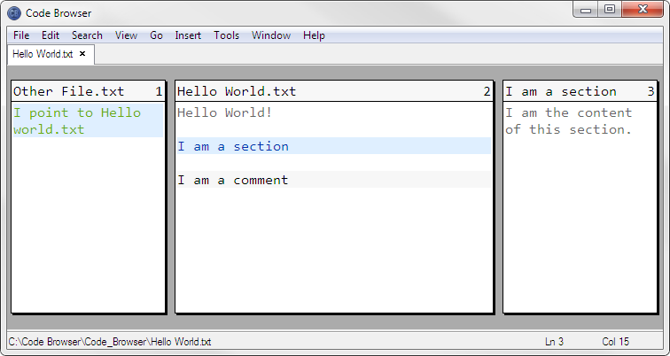

# Code Browser 4.9

[Introduction](#introduction) • [Why this repo?](#why-this-repo) • [What do i find here?](#what-do-i-find-here) • [Installation](#installation) • [Keyboard shortcuts](#keyboard-shortcuts) • [Credits](#credits)

## Introduction

[Code Browser](http://tibleiz.net/code-browser/) is a [code folding text editor](http://www.tibleiz.net/code-browser/code-folding.html) written by Marc Kerbiquet. Its nice features include *sections* (sometimes called *folders*, allows to fold away parts of the code, blue in the above screenshot), *links* (allows crosslinking in code files, green in the screenshot) and *descriptions* (pretty looking comments, gray in the screenshot). It loads very fast and is able to load very big files.

Not so nice is that it does not have an autocompleter, refactoring, linting, and other features which full throttle IDE´s like Pycharm provide. Currently i solve it by using [Typing Aid](https://github.com/ManiacDC/TypingAid) for autocompletion and i use other editors for the rest. Code Browsers own scripting language (which i wish was [Python](https://www.python.org/) or [Nim](https://nim-lang.org/)) can solve many of those issues.

## Why this repo?

This is a backup of version 4.9. The current version is 6.6 and Marc Kerbiquet removed those older downloads from [his site](http://tibleiz.net/code-browser/download.html) ([archive.org still has them](https://web.archive.org/web/20160912162221/http://tibleiz.net:80/code-browser/download.html)).

What is so special about version 4.9? It was the last version that supported *relative indentation*. (I think) Marc removed this feature after version 4.9 because it restricted the performance of another new feature.

*What is relative indentation? Example: We [fold](http://www.tibleiz.net/code-browser/code-folding.html) a class method in Python to a section. Then we indent the resulting blue section line by one tab. With relative indentation: The `def` keyword inside of the section will start at column 0. Without relative indentation (the default since version 4.9): This `def` keyword will start at column 1 (where it started before we folded it).*

Therefore the behaviour since version 4.9 is not so pleasant when using indentation sensitive languages like [Python](https://www.python.org/) or [Nim](https://nim-lang.org/). We can just fold global classes and functions with it, otherwise we will have those indents inside of the sections.

Another issue with versions since 4.9 is that `ctrl` + `shift` navigation inside of links now switches the level. For example when we have lists of links in lists of sections, then we can not navigate between sections any more, using `ctrl` + `shift` + (`up` or `down`).

## What do i find here?

Here are the [original version 4.9 portables and the source code](#install-the-editor).

Further my [configuration file](#enable-the-color-scheme-optional), which, amongst other things

* defines a new color scheme, *Bob*, see the screenshot, you can edit it under *Themes → Bob*,
* defines some tools, you can edit them under *Tools*,
* sets page view (`F5`) as the default,
* per default turns on word wrapping and turns off elastic tabstops (because it does not play together with word wrapping),
* changes some [keyboard shortcuts](#keyboard-shortcuts).

Further here are my [userscripts](#enable-the-user-scripts-optional), which provide extended functionality. See [Keyboard shortcuts](#keyboard-shortcuts) for what they do.

*I am in the process of rewriting the scripts. Currently the code is not nice to look at, but it works.*

## Installation

### Install the editor

Choose the portable version fitting your OS from the `Setup` folder and [unzip](https://www.7-zip.org/) it somewhere.

### Create the user config directories (optional)

After [Installing the Editor](#install-the-editor), start the executable once. This will create the user config directories (or create them manually). They are located at

* `$(HOME)/.code-browser-4` on Linux and
* `\Documents and Settings\<You>\Application Data\code-browser-4` on Windows.

*Customizing* → *Files* in the Code Browser docs explains how Code Browser loads its configuration files.

### Enable the color scheme (optional)

After [Installing the Editor](#install-the-editor), navigate

* *(Windows)* to the `config` folder located in the same directory as the Code Browser executable.
* *(Linux)* to `/usr/local/share/code-browser-4`.

Replace the `preferences.cbc` located there with the one located here.

The color scheme tries to use these fonts in that order: [Consolas](https://www.google.com/search?q=Download+Consolas+font), [Lucida Sans Typewriter](https://www.google.com/search?q=Download+Lucida+Sans+Typewriter+font), [Courier New](https://www.google.com/search?q=Download+Courier+New+font), Monospace. They look best on my screen, but they may not on yours. You can change the font under *Themes → Bob → Font*.

### Enable the user scripts (optional)

[Create the user config directories](#create-the-user-config-directories-optional).

Overwrite the `user.cbs` (the scripts) and the `user.cbc` (connects the scripts with the editor) in the user config directory with the ones in the `User Scripts` folder located here.

## Keyboard shortcuts

These are the most common shortcuts defined in the [Bob theme](#enable-the-color-scheme-optional). Edit them under *Key Mappings → Bob*.

Those having a `*` behind them are only available when [the user scripts are enabled](#enable-the-user-scripts-optional). You can change these shortcuts in the `user.cbc`.

### Views

* `F4` to `F7` – enable simple or page or tree or browser view.

*Notice that due to a bug in Code Browser you will not be able to navigate back to a previous file when you switch views inbetween. In that case you need to reopen that previous file manually.*

### Navigation

* `alt` + (`up` or `down`) – navigate to the previous or next section or link.
* `alt` + (`right` or `left`) – navigate into or out of sections and links.
* `ctrl` + `shift` + (`up` or `down`) – shortcut for typing `alt` + `left`, `alt` + (`up` or `down`), `alt` + `right`.
* `ctrl` + `alt` + (`up` or `down`) \* – navigate to the previous or next paragraph. (paragraph = lines of code separated by empty lines). Pressing `shift` will also select the paragraph.

### Edit sections

* `F12` – create a section. When text is selected, this will become the content of the section.
* `shift` + `F12` – delete a section. Its contents will be moved to the current level.
* `alt` + `enter` – edit the properties of a section or a link.

### Move code, fold and unfold sections

* `ctrl` + `alt` + (`left` or `right`) \* – if something is selected, move that selection left or right, otherwise fold the paragraph or unfold the section line under the cursor.
* `ctrl` + (`up` or `down`) \* – move line or selection one line up or down.

### Outcomment and unoutcomment code

* (`shift` +) `alt` + `x` \* – outcomment/unoutcomment the current line or the selection. Works recursively on sections.

### Bookmarks

* `ctrl` + `F2` – bookmark or unbookmark a line.
* (`shift` +) `F2` – navigate to the next or previous bookmarked line. Bookmark navigation does not work across different files and bookmarks are not remembered between sessions.

### Search and replace

* `ctrl` + `r` – open the search and replace dialog.
* `alt` + `r` – when the search dialog has the focus, select the first search result or replace the current and select the next search result.
* (`shift` +) `F3` – find the next or previous search result, do not replace the current.

### Other

* `esc` – close any open dialog at the bottom or, if no dialog is open, close the current tab.
* `alt` + `f4` – exit Code Browser. If there are dirty files Code Browser will show a prompt what to do.

## Credits

Many thanks go to [Marc Kerbiquet for creating this enjoyable editor and other cool tools](http://tibleiz.net/).

Written 2019-09-26 by [heronils](https://github.com/heronils?tab=repositories). Last update: 2019-09-28.
