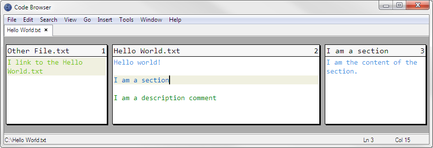
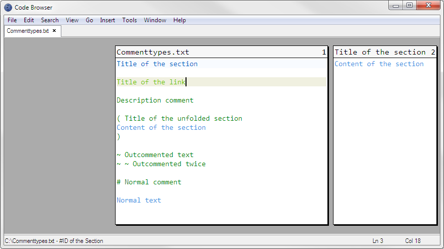

# Code Browser 4.9

*[In deutsch lesen](README.md)*

[Introduction](#introduction) • [Why this repo](#why-this-repo) • [Installation](#installation) • [Keyboard Shortcuts](#keyboard-shortcuts) • [Directives](#directives) • [Tips and Tricks](#tips-and-tricks ) • [Version History](#version-history) • [Credits](#credits)

*Screenshot of Code Browser*

## Introduction

[Code Browser](http://tibleiz.net/code-browser/) is a Zen-style text editor written by [Marc Kerbiquet](http://tibleiz.net/). It loads in a split second and also displays huge files without great delays. It has its own scripting language, with which one can extend the functionality of the editor.

But its revolutionary feature is how it interprets and displays special [directives](#directives) in source code:

* *Sections*. Dark blue in the screenshot. They fold away freely chosen parts of the code. You can navigate in and out of such sections using `Alt` + (`→` or `←`) just as you can navigate in and out of folders in file browsers. Which is why sections were originally called *folders* by Marc Kerbiquet.

  Sections can be nested arbitrarily deep. Thus, one can convert a linear code file into a tree of 'mini-files', which is very supportive to code structuring. However, it actually remains a single file.
* *Links*. Light green in the screenshot. They extend the concept, and make it possible to insert links to other sections or to other files, similar to [hyperlinks](https://en.wikipedia.org/wiki/Hyperlink) in HTML documents. In practice, links are often used in index files or docs, less often in the code itself. They offer other interesting possibilities because of their ability to link to line numbers or even search results of regular expressions.
* *Descriptions*. The forest green text in the screenshot. They are 'visual sugar'. They are nice-to-look-at, optionally color-highlighted comments. The comment characters are hidden. My user scripts use descriptions for special directives.

More information can be found in the help file or [on the project page](http://www.tibleiz.net/code-browser/code-folding.html).

## Why this repo?

Unfortunately, after version 4.9, the author removed an important feature - relative indentation (see *Folding* → *Relative Indentation* in the help file) - which renders the editor rather useless for indentation-based languages like [Python](https://www.python.org/ ). Furthermore, the sibling navigation has been changed - `Ctrl` + `Shift` + (`↑` or `↓`) - which now changes the level when navigating across section borders.

Since I need these features in [Treesearcher](https://github.com/heronils/Treesearcher), here is a backup of version 4.9, as well as my global settings and my user scripts.

## Installation

1. Download the portable which fits your operating system from the `Setup` folder located here and [unpack it](https://www.7-zip.org/). The editor is the `cb.exe` under Windows and the `code-browser` in the folder `usr/local/bin` under Linux.

The following steps are optional but i recommend them.

2. Read the section *Customizing* → *Files* in the contained help file.

3. Start the editor once. This creates the user directories described under 2. If necessary, [search system-wide](https://www.voidtools.com/) for `code-browser-4` under Windows or `.code-browser-4` under Linux. These folders are the user directories.

4. *Change global settings*: Replace the global `preferences.cbc` with the one in this directory.

   The main differences are: Relative indentation is set as default, a (in my opinion) prettier to look at theme is used (See *Themes* → *Purple-Blue* in `preferences.cbc`), some shortcuts are redefined (see *Key Mappings* → *Nils*), and some languages ​​are changed (see *Languages​​*). Among other things, Python (`Alt` + `p`) and Node.js (`Alt` + `n`) are defined as tools (see *Tools*).

   The `preferences.cbc` can be changed at will, **but will - [if you have used the installer](https://web.archive.org/web/20160912162221/http://tibleiz.net:80/code-browser/download.html) - be overwritten during a reinstall**.

5. *Enable user scripts*: Move the `user.cbs` and the `user.cbc` here in the directory into the user directory created in step 3. The `user.cbs` are the scripts, and the `user.cbc` connects the scripts to the editor.

   *Note that the layout of `user.cbc` is destroyed when you make changes within Code Browser via 'Tools' → 'Options ...'. If necessary, make a backup of this file.*

   The user scripts provide additional functionality such as folding and unfolding sections and commenting out parts of the code.

## Keyboard Shortcuts

[If my user scripts and my user settings are installed](#installation), the Code Browser uses the following keyboard shortcuts. The shortcuts can be changed under `preferences.cbc` → *Key Mappings* → *(activated Key Mapping)*. Those prepended with the text *(user script)* are defined by my user scripts and can be changed in the `user.cbc`.

### Basics
* `Ctrl` + `z` and `Ctrl` + `y` – Undo and Redo
* `Ctrl` + `Shift` + `s` – Save all files, including those not visible (for example, those that you have changed and from which you then have navigated away via link).
* `Esc` – Close any dialog below the editor or, if no dialog is open, close the current tab.
* `Alt` + `f4` – Exit Code Browser. If files are unsaved, Code Browser will ask what should be done.
* ... and more, which you can inspect in the main menu.

### View modes

* `F4` to `F7` – Switch between the four different view modes of Code Browser.

  *Because of a bug in Code Browser, you can not navigate back to a previous document via link when you change the view mode in between. In that case you have to reopen the previous document by hand.*

### Navigation

* `Alt` + (`↑` or `↓`) – Jump to the previous or the next section/link.
* `Alt` + (`→` or `←`) – Move into or out of a section/link.
* `Ctrl` + `Shift` + (`↑` or `↓`) – Jump to the previous or next sibling section in the parent layer – Shortcut for `Alt` + `←`, `Alt` + (`↑` or `↓`), `Alt` + `→`.
* *(user script)* `Ctrl` + `Alt` + (`↑` or `↓`) – Jump to the previous or next paragraph (paragraph = lines separated by blank lines).
* `Alt` + `g` – Jump to the line number to be entered.
* `Ctrl` + `b` – Jump to the corresponding bracket. Additionally `Shift` selects the text in between.

### Sections

* `F12` – Create a new section. If text is selected, it will become the content of the section.
* `Shift` + `F12` – Delete the section under the cursor. Its content is not deleted but moved to the parent level.
* `Alt` + `Enter` – Edit the properties of the section or the link under the cursor.
* *(user script)* `Ctrl` + `Alt` + (`←` or `→`) – Fold the paragraph under the cursor or unfold the section under the cursor.

  *Without the closing marker of an unfolded section – `)` – you can not fold the section again.*

### Links

* `Ctrl` + `Alt` + `c` – Copy a link to the current section to the clipboard. Can then be inserted elsewhere with `Ctrl` + `v` – also into other files.

  For this to work, the section and all parent sections must have an ID (ID = a freely choosable text). It can either be added by hand for a section (or a link) pressing `Alt` + `Enter` when the cursor is on the section or link line, or simply unfold the section once with `Ctrl` + `Alt` + `→` and then fold it again with `Ctrl` + `Alt` + `←`. This equates the ID with the title of the section.

There is no shortcut defined to create a link by hand, because that´s a cumbersome procedure anyway.

### Descriptions

* `F11` or `F10` – Convert the selected text to a description or back to normal text.

### Moving text

* *(user script)* `Ctrl` + (`↑` or `↓`) – Move the current line or selection one line up or down. The selection does not have to be a cleanly selected block, it simply moves all lines in which something is selected.

### Outcommenting and unoutcommenting code

* *(user script)* (`Shift` +) `Alt` + `x` – Outcomment or unoutcomment the current line or selection. Uses `~<space>` as directive. Works recursively on sections.

### Bookmarks

* `Ctrl` + `F2` – Set a bookmark.
* (`Shift` +) `F2` – Jump to the next or previous bookmark. Bookmark navigation works only within a single file and bookmarks are not persistent between sessions.
* (`Shift` +) `Ctrl` + `m` – Highlight all occurrences of the currently selected text in the current document or remove all highlightings.

### Search and replace

* `Ctrl` + `r` – Open the *Find and replace* dialog.
* `Alt` + `r` – If the *Find and Replace* dialog has the focus, select the first search result, or replace it and select the next search result. Unfortunately, this keyboard shortcut can not be changed.
* (`Shift` +) `F3` – Find the next or the previous search result, do not replace the current one.

## Directives

Here is a reference of the meta characters and -character groups that are meaningful for Code Browser and my user scripts. That´s how they would look in another editor. Those that are relevant for Code Browser are highlighted in yellow. Those that are relevant for my user scripts are highlighted in orange. The latter only have meaning when they are placed at the beginning of a description comment.

*Edit: At least they should be colored, but Github´s markdown parser does not support colored highlighting. Browser extensions like [this for Firefox](https://addons.mozilla.org/de/firefox/addon/markdown-viewer-webext/) or [this for Chrome](https://chrome.google.com/webstore/detail/markdown-viewer/ckkdlimhmcjmikdlpkmbgfkaikojcbjk) will [show the highlights](https://raw.githubusercontent.com/heronils/Code_Browser_49/master/README_EN.md#directives).*

<pre>
#[of]ID of the Section:Title of the section
Content of the section
#[cf]

#[l]:Title of the link:#ID of the Section

#[c]Description comment

#[c]( Title of the unfolded section
Content of the section
#[c])

#[c]~ Outcommented text
#[c]~ ~ Outcommented twice

# Normal comment

Normal text
</pre>

This file would look like this in Code Browser:

*Different types of comments and how they look in Code Bowser*

The directives start with the language-specific metacharacter for [Comments](https://en.wikipedia.org/wiki/Comment_(computer_programming)). In this example, it is the hash sign – `#` – used by Code Browser by default for unknown file types, text and [Python](https://www.python.org/). For Javascript it is `//`, for CSS, which has no single-line comments, `/*` at the start of the line and `*/` at the end.

Comment characters can be defined in `preferences.cbc` under *Languages* → *(Language)* with the variable `line-comment`. Or with `open-comment` and `close-comment` if the language does not have single-line comments. If all three are defined, `line-comment` is preferred.

Directives are each in a separate line.

Meaning of the individual directives:

* `#[of]` and `#[cf]` opens and closes a section (originally called *Folder*). The colon – `:` – separates the ID of the section (that to which links point) from the title of the section.
* `#[l]:` denotes a link. The second colon separates the title of the link from the target of the link.

  The syntax for link destinations is about the same as [URLs](https://en.wikipedia.org/wiki/URL). If the destination is an absolute file path, it must start with `file:///`. Relative link goals are also possible. If the target is a section, append a hash sign – `#` – followed by the path to the section, to the file path. So `file:///<file path>#<path to the section within the file>`. If the section is in the same file, you can omit the file path, as in the example above.

  You can also link to line numbers by appending `?aln=<number>` (*absolute line number*). And more, see section *Links* in the help file.

  The easiest way to create links is to use `Ctrl` + `Alt` + `c` – [See Keyboard Shortcuts → Links](#links).
* `#[c]` denotes a description line.
* `#[c](<Space>` and `#[c])` opens and closes an unfolded section.
* `#[c]~<Space>` denotes an outcommented line.
* `#` denotes a normal comment that has no special meaning for Code Browser or for my user scripts.

## Tips and tricks

* The color scheme used by my `preferences.cbc` tries to use the following fonts in this order: *[Consolas](https://www.google.com/search?q=Download+Consolas+font)*, *[Lucida Sans Typewriter](https://www.google.com/search?q=Download+Lucida+Sans+Typewriter+font)*, *[Courier New](https://www.google.com/search?q=Download+Courier+New+font)*, *Monospace*. You can change these fonts under *Themes* → *Basic* (search for `font-family`).
* All defined languages – except for the root language `Default` – inherit variables from a parent language via `prototype = languages.<parent language>`. You can change these variables in a specific language by simply copying them there. `<Name of variable> =` sets the variable to null, it then does not inherit from the parent variable either.
* Due to a bug in Code Browser, the type of indentation cannot be detected dynamically. By default, **tabs are used for indentation**, except in the [Elm](https://elm-lang.org/) language, which requires two spaces. If you want to use spaces for the indentation instead, please follow the instructions under *Languages* → *Defaults* → *Default* → *Tabs* in the `preferences.cbc`.
* You can not use underscores – `_` – within `*.cbc` files, but the separator sign – `-`.
* Code Browser can not do code completion. The Autohotkey-based [Typing Aid](https://github.com/ManiacDC/TypingAid) can help.
* Use the paragraph navigation - `Ctrl` + `Alt` + (`↑` oder `↓`) - to quickly navigate through code files.
* The easiest way to give a section an ID is to unfold it once and then fold it again. This equates the section ID with its title.
* Structure code semantically based on what it does, not what it is.
* Structure code like a fractal. If a function *B* is only used by a function *A*, add *B* as a sub-section at the beginning within the section in which *A* is defined. Put a function *C* that is only used by *B* into the section of *B*, and so on. Do the same with classes and variables.
* If longer areas of code are affected by a comment, use unfolded sections.
* Fold longer sections of code, used to fill a variable, into a section and give that section the name of the variable.
* Temporary fold out completed areas while writing code.
* To compare areas of code insert a temporary link to the other code area so that you can quickly switch back and forth.
* Add links to other code locations about which you talk in comments.
* Create a global index file that contains links to all code files that you work on regularly. Pin this index file to the list that pops up when you right-click the Code Browser icon on the taskbar (To appear in this list, the file must have been opened in Code Browser via *File* -> *Open ...*).
* Don't fold too much. If it fits on one screen, it is usually enough.
## Version History

### Version 1

First commit.

### Version 2

* Completely revised the user script and fixed some bugs. The scripts for commenting out source code and unfolding sections now use description comments instead of normal comments.
* Pimped the color scheme. The basic idea is to display local variables in blue and predefined variables/functions in purple. In this way, accidental shadowing can be prevented. Unfortunately, the functionality is somewhat limited. Therefore, the text is displayed in blue in normal text files.
* Many languages optimized accordingly.
* Many other minor fixes

## Credits

Many thanks to Marc Kerbiquet for [Code Browser](http://tibleiz.net/code-browser/) and [for other languages, tools, and games he wrote](http://tibleiz.net/).

This text was translated from german with the help of [Google Translate](https://translate.google.com/). If you find errors here, please open an [issue](https://github.com/heronils/Code_Browser_49/issues) or make a [pull request](https://help.github.com/en/articles/creating-a-pull-request).

Posted 2019-09-26 by [heronils](https://github.com/heronils?tab=repositories). Last update: 2020-05-08.
